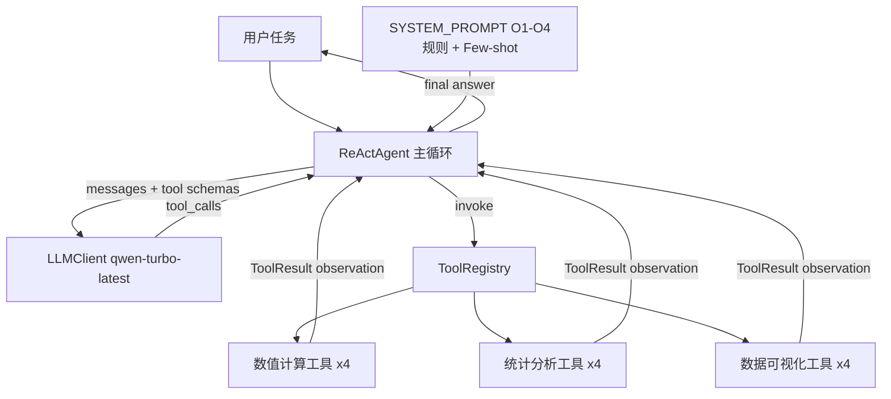

# 中期报告素材整理

> 本文件整理了撰写毕业设计中期报告所需的全部关键素材：数据表格、案例对比、系统架构描述、Prompt 优化汇总。
> 直接从本文件中复制内容写入中期报告即可，无需重新查找数据。

---

## 一、核心数据表格

### 1.1 v3 基线对比表（Prompt 优化前，2026-04-21）

| 配置 | 题数 | 成功 | 成功率 | 平均迭代轮数 | 平均工具调用次数 | 平均耗时(s) |
|---|---:|---:|---:|---:|---:|---:|
| B0（无工具） | 46 | 22 | **47.8%** | 1.00 | 0.00 | 9.90 |
| B1（最简提示） | 46 | 44 | **95.7%** | 3.11 | 2.76 | 6.03 |
| Ours（优化提示） | 46 | 43 | **93.5%** | 3.30 | 2.33 | 7.53 |

数据文件：`outputs/eval/20260421_094645/summary.md`

### 1.2 v4 基线对比表（Prompt 优化后 O1~O4，2026-04-21）

| 配置 | 题数 | 成功 | 成功率 | 平均迭代轮数 | 平均工具调用次数 | 平均耗时(s) |
|---|---:|---:|---:|---:|---:|---:|
| B0（无工具） | 46 | 23 | **50.0%** | 1.00 | 0.00 | 14.15 |
| B1（最简提示） | 46 | 45 | **97.8%** | 3.02 | 2.61 | 6.55 |
| Ours（优化提示） | 46 | 45 | **97.8%** | 3.37 | 2.37 | 7.62 |

数据文件：`outputs/eval/20260421_112857/summary.md`

### 1.3 Ours vs B1 效率 Delta（v4，44 道共同通过的题目）

| 指标 | Ours vs B1 |
|------|-----------|
| 成功率 | **持平**（同为 45/46） |
| 平均迭代轮数 | **+10.5%**（Ours 略多） |
| 平均工具调用次数 | **−8.8%**（Ours 更精简） |
| 平均耗时 | **+15.8%**（Ours 略长） |

> 解读：Ours 在准确率上与 B1 持平的同时，工具调用次数减少约 9%，说明优化后的 prompt 引导 agent 更有效地规划工具使用步骤，减少了冗余调用。

### 1.4 按类别分布（B0 / B1 / Ours，v4）

| 类别 | B0 | B1 | Ours |
|------|---:|---:|---:|
| composite（综合多步） | 5/18 (28%) | 17/18 (94%) | 17/18 (94%) |
| error_recovery（容错恢复） | 5/6 (83%) | 6/6 (100%) | 6/6 (100%) |
| numerical（数值计算） | 7/8 (88%) | 8/8 (100%) | 8/8 (100%) |
| statistics（统计分析） | 6/8 (75%) | 8/8 (100%) | 8/8 (100%) |
| visualization（数据可视化） | 0/6 (0%) | 6/6 (100%) | 6/6 (100%) |

---

## 二、系统架构描述

### 2.1 架构文字描述（用于正文）

本系统基于 ReAct（Reasoning + Acting）框架设计，核心组件包括：

1. **工具库**（`src/tools/`）：12 个科学计算工具，分三类：
   - 数值计算：`matrix_operation`、`numerical_integration`、`curve_fitting`、`equation_solver`
   - 统计分析：`descriptive_statistics`、`hypothesis_test`、`linear_regression`、`correlation_analysis`
   - 数据可视化：`line_chart`、`scatter_chart`、`bar_chart`、`heatmap`
   - 每个工具均继承 `BaseTool` 抽象类，实现统一的 `to_openai_schema()` 接口，供 LLM Function Calling 使用

2. **LLM 客户端**（`src/llm/client.py`）：封装通义千问 API（OpenAI 兼容接口），含超时控制（60s）和网络错误指数退避重试（最多 3 次）

3. **ReAct Agent 主循环**（`src/agent/react_agent.py`）：
   - 每轮：调用 LLM → 解析 tool_calls → 执行工具 → 将 observation 追加到 messages → 循环
   - 终止条件：模型不再发出 tool_calls（给出最终答复）或达到最大迭代次数（默认 10）
   - 关键设计：`agent.messages` 完整保留 assistant + tool 消息历史，使 LLM 可以看到所有中间结果

4. **系统提示词**（`src/prompts/system_prompts.py`）：
   - `SYSTEM_PROMPT`：科学场景优化提示，含 7 条规则（开场规划、思考格式、工具数量、结果引用、合理性检查、数值规范、容错、终止条件）+ few-shot 示例
   - `MINIMAL_PROMPT`（B1 基线用）：仅告知模型可用工具，不含任何额外规范

5. **评估框架**（`src/eval/`）：自动运行测试用例，从最终答复中提取数字（正则匹配），与期望值做相对容差比对，同时检查图表文件大小和工具调用记录

### 2.2 架构图（Mermaid，可直接粘贴到文档）



---

## 三、五道关键 Case 的 Trajectory 对比

这五道题是论文"方法设计动机"和"实验分析"章节的核心素材。

---

### Case 1：vhard_01 — 拟合工具异常输出（O1 规则的动机）

**任务**：放射性衰变 N(t) = N0·exp(−λt)，给定 7 个观测点，用数值拟合求 N0、λ 和半衰期 t_half。

**v3 Ours（FAIL，2 轮）**：
```
[iter 1] call curve_fitting -> ok
          返回：a=1000, b=-7.02, r_squared=-0.28（R²为负！）
[iter 2] final answer: "虽然 R² 为负值（可能因数据点较少），
          但指数拟合仍能提供合理的物理参数估计。
          λ ≈ 7.02 min⁻¹，t_half ≈ 0.0988 min（约 5.93 秒）"
          → 物理意义荒谬（真实半衰期约 13.9 分钟）
```

**v4 Ours（PASS，3 轮，O1 修复后）**：
```
[iter 1] call curve_fitting -> ok
          返回：r_squared=-0.28（异常，触发 O1 检查）
[iter 2] call linear_regression -> ok
          对 ln(N) 做线性回归，返回 slope=-0.0500, intercept=6.908, r_squared≈1.0
[iter 3] final answer: N0=exp(6.908)≈1000.09, λ=0.0500, t_half=ln(2)/0.0500≈13.87 min ✓
```

**对比要点**：v3 中 agent 识别到 R² 为负但仍采信输出（"盲信工具"）；O1 规则明确规定 R²<0 视为异常并 MUST 切换方法，v4 中 agent 自动切换到对数变换 + 线性回归，得到正确结果。

---

### Case 2：stats_08 — 清理后均值心算出错（O2 规则的动机）

**任务**：数据 [2.1, 2.3, 2.4, 2.5, 2.6, 2.7, 15.0]，先算描述性统计，识别异常值（IQR法），去除后算 cleaned_mean（期望 2.43333）。

**v3 Ours（FAIL，2 轮）**：
```
[iter 1] call descriptive_statistics -> ok（得到 Q1=2.35, Q3=2.65, IQR=0.3）
[iter 2] thought: 异常值为 15.0，清理后数据=[2.1,2.3,2.4,2.5,2.6,2.7]
          → 心算 cleaned_mean = (2.1+2.3+2.4+2.5+2.6+2.7)/6 ≈ 2.4（计算错误！）
          final answer: cleaned_mean = 2.4  → FAIL（期望 2.43333）
```

**v4 Ours（PASS，3 轮，O2 修复后）**：
```
[iter 1] call descriptive_statistics(全部7个数) -> ok
[iter 2] call descriptive_statistics([2.1,2.3,2.4,2.5,2.6,2.7]) -> ok
          返回：mean=2.43333（精确值）
[iter 3] final answer: cleaned_mean = 2.43333 ✓
```

**对比要点**：v3 中 agent 在去除异常值后做了"小规模心算"（6 个数也偷懒了，且算错）。O2 规则明确要求"过滤后的新样本集 MUST 再调一次 descriptive_statistics"，彻底消除了此类错误。

---

### Case 3：hard_03 — 数值精度截断（Ours 现有优势）

**任务**：计算 Treatment 组均值 mean_T，期望 49.1625，精度 tol=0.001（即需要报出 49.162x 级别）。

**v4 B1（FAIL）**：
```
final answer: "mean_T = 49.16"  → 截断了后两位，被 checker 判 miss（|49.16 - 49.1625| = 0.0025 > abs_tol）
```

**v4 Ours（PASS）**：
```
[iter 2] call descriptive_statistics -> 返回 mean=49.1625
[iter 5] final answer: "mean_T = 49.1625" → 完整保留 ✓
```

**对比要点**：SYSTEM_PROMPT 的精度要求规则（"至少保留 4~6 位有效数字"）使 Ours 保留了工具返回的完整值，而 B1 没有此规范，随手四舍五入导致失败。

---

### Case 4：vhard_02 — 符号约定（Ours 现有优势）

**任务**：双样本 t 检验，题目要求"若 mean_B > mean_A，则 t_statistic 报正值"。

**v4 B1（v3 中 FAIL，v4 中 PASS）**：
- v3 中 B1 直接报了 scipy 返回的 t=-7.22（带负号），忽略了符号约定
- v4 中 B1 已改为 PASS（可能是 LLM 随机性）

**v4 Ours（PASS）**：
```
[iter 3] call hypothesis_test -> 返回 t=-7.31（scipy 默认 A-B）
[iter 5] thought: "题目要求若 B>A 则报正值，mean_B=0.181>mean_A=0.130，故取 |t|=7.31"
          final answer: t_statistic = 7.31 ✓
```

**对比要点**：SYSTEM_PROMPT 包含科学写作规范引导，使 agent 能识别题目对结果符号约定的要求，而非机械输出工具返回值。

---

### Case 5：comp_07 — v4 回归（O2 规则的边界模糊问题）

**任务**：4 步链式任务：① 求矩阵 A 的特征值，取较大者 b；② 积分 ∫sin(x)dx over [0,b]，得 I；③ 解方程 x²-(I+1)=0 的正根；④ 报告结果。checker 要求调用 equation_solver。

**v4 Ours（FAIL，3 轮）**：
```
[iter 1] call matrix_operation(eigenvalues) -> b=3.0
[iter 2] call numerical_integration -> I≈1.989992
[iter 3] thought: "x² - c = 0，这是简单平方根问题，无需 equation_solver，直接 x = √c"
          final answer: root ≈ 1.729156 ✓（数值正确）
          → 但未调用 equation_solver → tool_call checker FAIL
```

**对比要点**：这是 O2 豁免条款"简单标量操作允许在 thought 中计算"被 agent 过度泛化的结果。实际上代数化简是正确的，但 checker 要求必须调工具。这属于"规则边界模糊"问题，可在论文局限性章节讨论：prompt 规则无法覆盖所有边界情况，硬性工具要求与 agent 的自主推理能力存在张力。

---

## 四、Prompt 工程四条规则汇总表

| 规则编号 | 规则名称 | 核心条款摘要 | 对症问题 | 目标 Case | v3→v4 | 文件位置 |
|---------|---------|------------|---------|----------|-------|---------|
| O1 | 结果合理性检查 | 拟合 R²<0 或>1、参数量级失配、NaN/Inf → 视为异常，MUST 换方法 | agent 盲信工具异常输出 | vhard_01 | FAIL→PASS | `system_prompts.py` 【结果合理性检查】段 |
| O2 | 数值计算规范 | ≥3 个样本 MUST 走 descriptive_statistics；过滤后新样本集 MUST 再调一次工具 | agent 绕过工具心算 | stats_08 | FAIL→PASS | `system_prompts.py` 【数值计算规范】段 |
| O3 | 开场规划模板 | ≥3 步任务第一轮 content MUST 写 Plan: 1. 2. ...；后续按 Plan 推进 | agent 多步任务跳步偷懒 | comp_07/viz_03 | 稳定性提升 | `system_prompts.py` 【开场规划】段 |
| O4 | Few-shot 注入 | 在 SYSTEM_PROMPT 末尾追加冷却曲线拟合完整示例，演示 Plan + 异常检查 + 方法切换 + 精确报告 | trajectory 质量和效率 | vhard_01/vhard_04 | 效率改善 | `system_prompts.py` FEWSHOT_EXAMPLE 常量 |
| 附加 | 精度输出规范 | 最终答复报数字至少保留 4~6 位有效数字，不得擅自截断 | 数值精度截断 | hard_03 | Ours 已有优势 | `system_prompts.py` 【终止条件】段 |

---

## 五、与开题报告的差异说明要点

| 方面 | 开题报告设想 | 实际执行 | 变化原因 |
|------|------------|---------|---------|
| 工具类别 | 包含 Biopython 生物信息学 | 砍掉，保留数值/统计/可视化 | 缩短开发周期，核心贡献更聚焦 |
| LLM 模型 | qwen-plus-latest | qwen-turbo-latest | turbo 更容易暴露 prompt 优化效果（plus 太强，区分度低） |
| 测试用例数量 | 10-12 个 | 46 个（5 类，3 档难度） | 更充分的统计显著性，覆盖更多 failure mode |
| 评估维度 | 正确性 | 正确性 + 工具调用效率 + trajectory 质量 | 多维度评估更科学，论文贡献更丰富 |
| 动态工具选择 | 写复杂启发式策略 | 依靠 LLM 推理 + prompt 引导 | LLM 自身推理能力已足够，复杂启发式不必要 |

---

## 六、后续工作说明（用于"后续计划"章节）

### 已完成的工程工作
- [x] 系统设计与实现（工具库 + Agent + 评估框架）
- [x] 测试集设计（46 题）
- [x] 多轮基线实验（v1~v4）
- [x] Prompt 工程优化（O1~O4）
- [x] 版本控制（GitHub 私有仓库）

### 列为 Future Work 的工程改进
- **O5：LLM 客户端层 JSON 错重试**：针对 qwen-turbo 偶发的 400 InvalidParameter 错误（如 viz_03），在 `src/llm/client.py` 加针对性重试。预计修复 1-2 道随机 FAIL 题。
- **O6：curve_fitting 工具的初始值自适应**：`src/tools/numerical.py` 中 `p0=[1.0, 0.1]` 对大量级数据收敛性差，改为按数据范围自动估计 p0。

### 论文撰写（剩余约 3 周）
- 第 1 周：整理实验数据，画好所有图表（成功率柱图、by-category 热力图、trajectory 对比图），完成论文提纲
- 第 2 周：撰写正文（引言、相关工作、系统设计、实验部分）
- 第 3 周：完成分析与讨论、结论，反复修改，准备答辩

---

*本文件由 AI 助手生成，供撰写中期报告参考。数据均来自项目 `outputs/eval/` 目录下的评估结果文件。*
